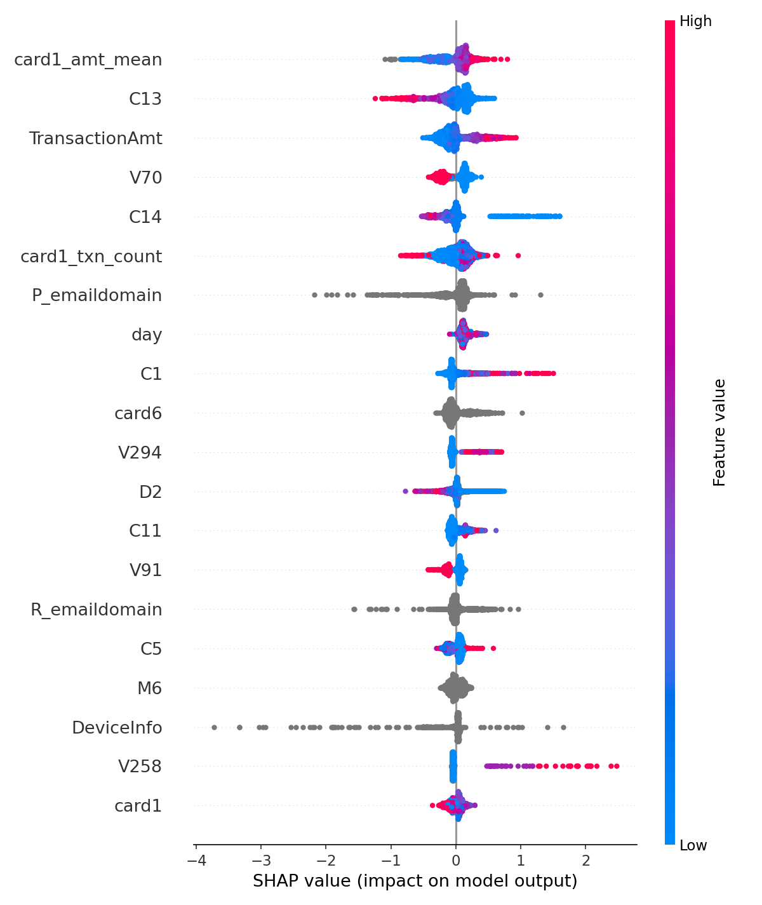

# Fraud Detection System

Fraud classifier built on the IEEE-CIS Fraud Detection dataset, with a
time-based validation split, cost-based threshold selection, SHAP
explainability, and a containerized serving API.

## Results

**Model**: LightGBM, time-based train/validation split (random splits leak
future information into validation on this dataset)

| Metric | Score |
|---|---|
| AUC-PR (validation) | 0.5216 |
| AUC-ROC (validation) | 0.9079 |

AUC-PR is the primary metric here, not AUC-ROC, since fraud is ~3.5% of
transactions and ROC-AUC is flattered by the large number of easy true
negatives.

### A metric mismatch that quietly hid the model's real performance

Early runs used `eval_metric="auc"` in `.fit()` but didn't set `metric` in
the LightGBM params themselves. LightGBM tracked both AUC and logloss under
the hood, and early stopping picked the best iteration by logloss, not AUC.
The result: training stopped at round 1 every time, with logloss looking
great but the model barely trained. AUC-PR sat at 0.2538. Explicitly setting
`metric="auc"` in the params fixed it, best iteration moved to round 288,
and AUC-PR jumped to 0.5216, more than double. Full details in `src/models/train.py`.

### Cost sensitivity: the "right" threshold depends on the business

Using `src/models/cost_sensitivity.py`, the cost-minimizing decision
threshold was computed under five different assumptions about the relative
cost of a missed fraud vs. a false alarm:

| Scenario | Cost ratio (FN:FP) | Best threshold | Precision | Recall |
|---|---|---|---|---|
| High-value fraud (e.g. wire transfers) | 200:1 | 0.10 | 0.057 | 0.965 |
| Baseline | 100:1 | 0.20 | 0.090 | 0.913 |
| Higher friction cost | 25:1 | 0.35 | 0.149 | 0.836 |
| Lower-value fraud / strict CX | 10:1 | 0.65 | 0.329 | 0.636 |

The optimal threshold ranges from 0.10 to 0.65 depending entirely on how
costly a missed fraud is assumed to be relative to a false alarm. Notably,
the two scenarios with the same 10:1 ratio (`200,20` and `500,50`) landed on
the identical threshold, confirming the optimizer responds to the *ratio*
of costs, not their absolute values. Full table: `cost_sensitivity_results.csv`.

### What actually drives the model (SHAP)



The single most important feature in the entire 439-column model is
`card1_amt_mean`, a custom aggregate (average transaction amount per card)
built in `src/features/build_features.py`, ranked above every one of
Vesta's own anonymized features. `card1_txn_count` and `day` (also
engineered) placed in the top 10. This is a directly measurable case
where feature engineering outperformed the dataset's built-in signals.

Limitation worth noting: most of Vesta's raw features (`C13`, `V70`, `C14`,
etc.) are anonymized, so their SHAP importance can be ranked but not
explained in terms of real-world meaning, that's a constraint of this
dataset, not the analysis.

## Setup (Windows / Anaconda)

## Run the pipeline

```
python -m src.data.load_data      # merges tables, saves to data/interim/
python -m src.models.train        # trains LightGBM, logs to MLflow, saves model
```

Check training runs with:
```
mlflow ui
```

## Serve the model

```
uvicorn src.api.main:app --reload
```

Then test it:
```
curl -X POST http://127.0.0.1:8000/predict -H "Content-Type: application/json" -d "{\"TransactionAmt\": 150.0, \"TransactionDT\": 86400, \"card1\": 1234}"
```

## Known limitation to document, not hide

The card-level aggregate features in `build_features.py` are computed
against a reference dataset. At training time that's the training split.
At serving time in `src/api/main.py`, there's no reference set wired up yet,
this needs to point at a rolling window of recent transactions (e.g. stored
in Redis or a feature store) before this is a real production system. Writing
this limitation up honestly, the same way the leakage issue got documented
in the code review paper, is worth more in an interview than pretending it's
solved.

## Project structure

- `src/data/` — loading and merging raw tables
- `src/features/` — feature engineering, shared between training and serving
- `src/models/` — training and evaluation
- `src/api/` — FastAPI serving layer
- `notebooks/` — exploratory work only, nothing here should be load-bearing
- `tests/` — unit tests for feature functions
